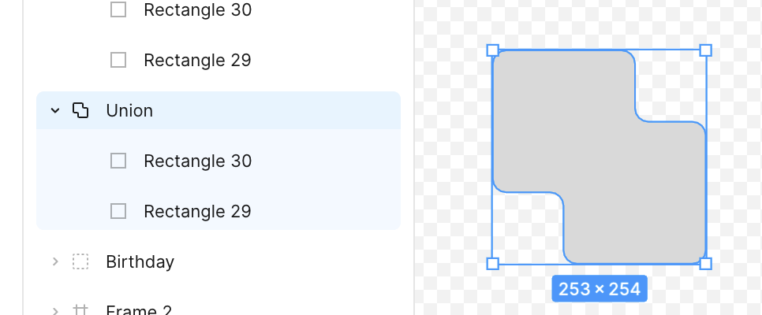

## 回答

- 最終的に **SVG として書き出して使われる前提**で作る。\
  余分なグループ・マスク・非表示レイヤーを残さない。
- 既存アイコンをカスタムするときは、**あとから修正できるようベクター（パス）を編集可能な状態で残す**。\
  統合させたりフラット化すると直せなくなる。

## 解説

### SVG 書き出しを前提にする

アイコンはコンポーネントとして配置しても、実装では SVG に変換して使われることが多い。\
塗り・線が意図どおり SVG に出るか、不要なノードが増えていないかを確認する。

### 修正の余地を残す

- 合体・型抜きは「統合」で確定させず、グループのまま保持しておくと、あとから個別のパスを動かせる。\
  
- 元の描画パスを残しておくと、線幅や角丸の調整をやり直せる。
