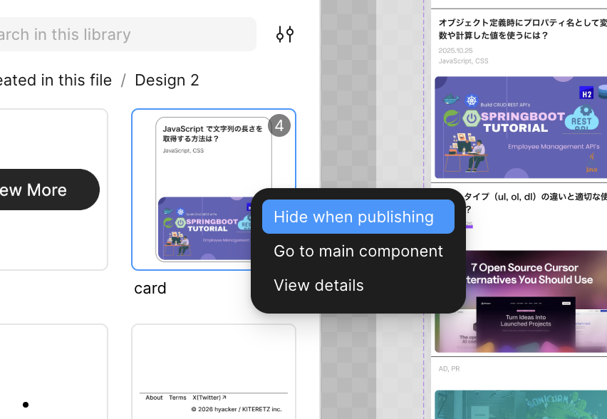

## 回答

**コンポーネント名の先頭に `.`（ピリオド）を付ける**方法と、**コンポーネントを右クリック →「Hide when publishing」** にする方法がある。

## 解説

### 方法

1. **コンポーネント名の先頭に `.`（ピリオド）を付ける**（例: `.icon-base`）。\
   レイヤーパネルで名前を変えるだけで、チームライブラリの公開対象から外れる。\
   手早く隠したいとき向け。
2. **コンポーネントを右クリック →「Hide when publishing」**。\
   アセットパネルの「Hidden」セクションに移動する。\
   Figma が正式にサポートする方法。\
   

### 使いどころ

バリアントの土台になるベースコンポーネントや、単体では使ってほしくない部品を、他ファイルのアセットパネルに出さないようにする。\
数が多いとライブラリが散らかり、選び間違いのもとになる。

### 補足

- `.` プレフィックスはコンポーネント向けの簡易な方法。\
  変数コレクションでは `.` または `_` プレフィックスが同じ役割を持つ。
- `.` プレフィックスは環境によって挙動が変わる・効かないという報告もある。\
  確実に隠したいときは「Hide when publishing」を使う。
- 同じ考え方で、レイヤー名の先頭にドットを付けてコンポーネント候補から外す運用は、実務のデザインライブラリでもよく使われる。
