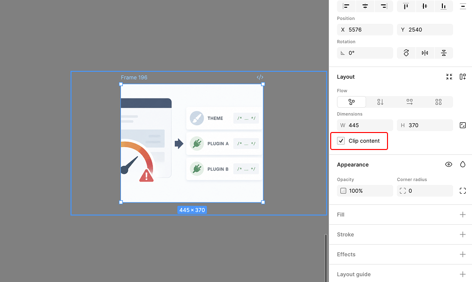

## 回答

画像は **フレームで囲んでクリップ**して配置するのがおすすめ。

## 解説

### 手順

1. 画像を選択して「フレームに変換」する（`Cmd + Option + G`）。
2. フレームの **「Clip content（内容を切り抜く）」をオン**にする。\
   
3. 画像はフレームの子レイヤーとして残るので、フレームのサイズやトリミング位置を変えても、画像自体は元の比率を保ったまま動かせる。

### フレームに画像を直接貼る方法との違い

フレームの塗り（Fill）として画像を入れる方法だと、フレームの縦横比を変えたときに見え方（Fill / Fit / Crop）の調整はできるものの、いったん比率を崩すと元の状態に戻しづらい。

子レイヤーとして画像を置いてクリップする方法なら、画像そのものは独立して選択・移動でき、比率も維持される。\
トリミングはフレーム側で行う。
